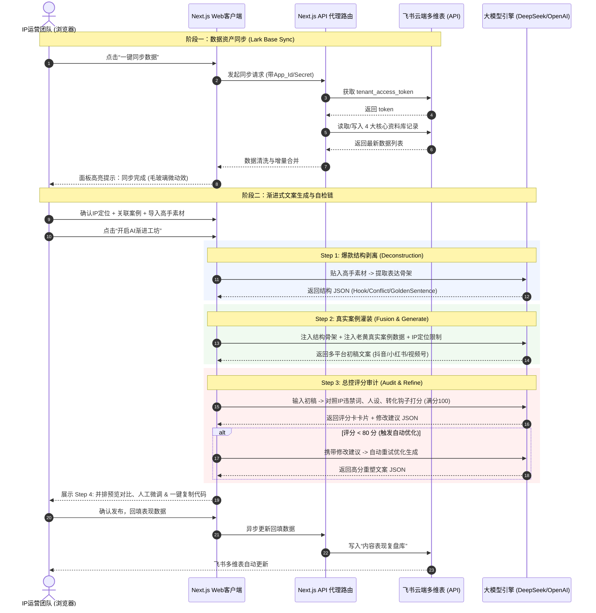

# 产品需求文档 (PRD): 老黄AI经营IP文案总控智能体 (MVP)

> **文档状态**: 已确认 (Socrates 推演锁定)  
> **设计风骨**: 现代毛玻璃驾驶舱风 (Glassmorphism Studio)  
> **核心骨架**: 五步渐进式工坊 (Progressive Magic Flow)  
> **数据底座**: 飞书多维表双向同步 (Lark Base Sync)

---

## 1. 核心战略与愿景 (Why)

### 1.1 核心目标 (Mission)
打造老黄专属的**“实战派 AI 转型 IP 内容发动机”**。通过“拆解高手结构 + 强制注入真实业务案例”的闭环自动化工作流，高质量、批量化产出具备高信任感、锋利观点和极高转化率的商业短视频/图文文案，为公司的高客单价“AI 转型解决方案”精准引流和获获客。

### 1.2 用户画像 (Persona)
* **核心使用者**：老黄个人 IP 运营团队（文案主编、短视频小编、老黄本人）。
* **核心痛点**：
  * 传统 AI 写作工具产出内容“假大空”、缺乏真实的电商与自动化踩坑细节。
  * 运营人员对老板的真实业务理解不够深，写出来的文案缺乏实战老板的语气（不像真人说的话）。
  * 爆款文案的“结构借鉴”分寸难拿捏，手工改写容易流于抄袭或完全走样。
  * 抖音、小红书、视频号排版格式各异，人工转换排版繁琐且无法闭环迭代。

---

## 2. 边界切割与路线图 (What)

### 2.1 V1：最小可行产品 (MVP) 功能列表
1. **五步渐进式工坊 (Workspace Wizard)**：
   * 采用 Step-by-Step 的向导式创作流程，确保每篇文案都经过“拆解 -> 注入 -> 生成 -> 自检”的精细打磨。
2. **飞书多维表双向同步 (Lark Base Integrator)**：
   * 支持配置飞书应用的 `App ID` / `Secret` 以及多维表的 `Table ID`。
   * 通过 Next.js 后端代理直接读取/写入 4 大核心数据库，实现多端数据协同与一键云端备份。
3. **三步串联智能重构引擎 (Chained LLM Engine)**：
   * **Step 1: 爆款结构剥离**，剔除原文修辞，提取表达骨架。
   * **Step 2: 真实案例灌装**，将老黄真实公司的改造动作与数据，完美融入骨架。
   * **Step 3: 总控评分审计**，自动检测 IP 违禁词、人设感、流量钩子和转化方向，低于 80 分自动触发重试润色。
4. **并排对比与实时微调 (Parallel Workspace)**：
   * 生成的抖音口播、小红书图文、视频号复盘以三栏并排的形式高亮呈现，支持一键复制代码和在线实时人工微调修改。
5. **管理驾驶舱级数据回填 (Performance Ledger)**：
   * 提供极简的数据回填入口，供小编每日输入发布后的播放量、点赞和线索转化，数据自动更新至飞书多维表，反哺 AI 模型。

### 2.2 V2 及以后版本 (Future Releases)
* **智能推荐（RAG 增强）**：基于历史表现库，系统自动检索哪些案例或文案结构的转化率最高，主动向主编推荐“爆款案例配爆款结构”。
* **自动化数据监测**：编写 RPA 脚本或部署轻量爬虫服务，自动从抖音、小红书、视频号创作后台抓取数据，实现免人工回填。
* **多 IP 矩阵扩展**：支持除“老黄”外的多 IP 体系，一键切换不同的“IP定位库”和“案例库”。

---

## 3. 用户体验与交互雕刻 (How - Design)

团队选定 **【原型概念二：五步渐进式工坊】** 作为核心骨架，整体界面采用 **现代毛玻璃风（Glassmorphism）**。

### 3.1 核心操作流向

```text
[Step 1: 资产装载] ---> [Step 2: 结构拆解] ---> [Step 3: 案例灌装] ---> [Step 4: 并排微调] ---> [Step 5: 自检归档]
   (选案例/素材)          (大模型剥离骨架)         (注入参数/平台多选)       (多栏并排比对)          (飞书同步表现)
```

### 3.2 五步交互原型规约

* **Step 1: 资产装载仓 (Asset Loader)**
  * **左栏**：快速展现当前的“IP 定位库”状态（一句话定位、人设、产品）。
  * **中栏**：飞书案例卡片流，支持快速搜索和“单选”当前要融合的真实案例。
  * **右栏**：高手文案卡片流，支持点选或直接“手动贴入外部链接/文本”。
* **Step 2: 结构拆解台 (Structure Decompiler)**
  * AI 自动解析高手文案，将结果以结构化卡片展示：【开头钩子】、【核心冲突】、【案例使用】、【结尾 CTA】。
  * 允许主编手动编辑修改被剥离出的骨架，防止 AI 产生解析幻觉。
* **Step 3: 案例参数腔 (Parameter Fusion)**
  * 提供多选框：【[x] 抖音口播  [x] 小红书图文  [x] 视频号口播】。
  * 提供 CTA 选择器：【( ) 自查 - 领自查表 | ( ) 诊断 - 约诊断服务】。
  * 点击“开启 AI 灵感重塑”后，触发齿轮旋转和毛玻璃柔光渲染动画。
* **Step 4: 并排编辑工坊 (Parallel Studio)**
  * 三栏毛玻璃卡片并排展示，极具通透感。
  * 每栏顶部带有一个快捷按钮：【一键复制】、【人工微调】（点击直接将文本块变为可编辑状态）。
* **Step 5: 审计与归档 (Auditing & Sync)**
  * 自动呈现“雷达评分卡”，对 IP 匹配度、案例感、钩子等打分。
  * 显示“飞书同步状态”，一键将生成的稿件和今日的发布数据同步回飞书多维表。

---

## 4. 架构设计蓝图 (How - Engineering)

### 4.1 核心业务与数据流图



### 4.2 现有文件影响与新增模块说明

本次重构与新增将直接作用于以下文件：

#### `[MODIFY]` [page.tsx](file:///Users/a123/Desktop/自动生成文案智能体/src/app/page.tsx)
* **交互层**：彻底重构为 5 步向导式 Stepper 状态机。
* **视觉层**：引入基于 CSS Backdrop-filter 的毛玻璃卡片（`bg-white/40 backdrop-blur-xl border-white/20 shadow-glass`）和苹果风 UI 质感。
* **逻辑层**：
  * 引入 `feishuConfig`（`appId`, `appSecret`, `appToken`）状态。
  * 将 `callRealLLM` 拆分为 `deconstructMaterial`、`generateCopywriting`、`auditCopywriting` 串联请求。
  * 增加飞书手动/自动同步函数。

#### `[NEW]` [route.ts](file:///Users/a123/Desktop/自动生成文案智能体/src/app/api/feishu/sync/route.ts)
* **核心职责**：飞书 API 代理网关。
* **技术背景**：由于飞书官方 API 存在严格的 CORS 跨域风控，浏览器直接 fetch 会被拦截；同时，将 `App Secret` 暴露在前端有极高的安全泄露风险。
* **实现逻辑**：
  1. 接收前端 POST 请求，携带密钥及需要读取/写入的 Table 标记。
  2. 在 Node.js 服务端发起请求，向飞书换取 `tenant_access_token`。
  3. 执行增量读取或增量回填，对多维表记录执行 `insert` / `update`。
  4. 清洗字段，将 Feishu Formatted Data 转化为标准的 React `DataContract` JSON。

#### `[MODIFY]` [globals.css](file:///Users/a123/Desktop/自动生成文案智能体/src/app/globals.css)
* **修改动作**：注入毛玻璃定制 `@utility` 类、柔和背景浮动粒子动画及高科技感的渐变步进器（Stepper）动画样式。

---

## 5. 技术选型与潜在风险应对

### 5.1 核心技术选型理由
* **Next.js API Route (服务端中转)**：绕过飞书 CORS 跨域限制，确保企业级凭证（`App Secret`）永不出网，保障架构安全。
* **串联型 AI Chain (多轮微推理)**：将爆款文案的生成任务化整为零。拆解、生成、审计各自使用最精准的指令集，彻底消除单次交互下的格式崩坏与跑偏现象。
* **React State 增量同步**：优先保证本地操作的流畅性，采取“本地即时反馈，后台异步同步”的策略，将数据延迟降至零。

### 5.2 潜在风险与应对方案
* **【风险 1】飞书 API 限频 (Rate Limit)**
  * *分析*：如果运营人员频繁点击同步，可能触发飞书的 QPS 阈值限制。
  * *应对*：实施本地防抖（Debounce）控制；默认加载时拉取一次，之后仅在执行“保存/同步”时手动触发批量提交。
* **【风险 2】串联生成耗时过长 (LLM Timeout)**
  * *分析*：三步调用，总耗时可能叠加至 15 秒以上，导致前端请求超时。
  * *应对*：在渐进工坊中引入高可视化的“步骤状态指示器”（例：`Step 1: 结构拆解中... (完成)` $\rightarrow$ `Step 2: 注入真实案例中...`），让用户对每一步的进度了如指掌，极大地缓解等待焦虑。

---

## 6. 飞书多维表结构映射契约 (DB Schemas)

为了确保双向同步完美无损，飞书多维表中需创建以下 4 张表，且字段名称需与系统完全一致：

### 6.1 表 1: IP定位表 (`ip_positioning`)
* `ip_definition` (单行文本) - IP一句话定位
* `target_clients` (单行文本) - 目标客户
* `core_themes` (多选) - 核心主题
* `banned_topics` (多选) - 不能讲什么
* `core_persona` (多行文本) - 核心人设
* `main_products` (多选) - 主要产品

### 6.2 表 2: 公司案例表 (`company_cases`)
* `case_id` (单行文本, 主键) - 案例编号
* `case_name` (单行文本) - 案例名称
* `problem` (多行文本) - 原始问题
* `action` (多行文本) - 核心动作
* `tools` (多选) - 使用工具
* `result` (多行文本) - 变化成效
* `public_assets` (多行文本) - 可公开素材
* `confidential` (多行文本) - 绝密红线
* `insight` (多行文本) - 可延展观点
* `suggested_titles` (多行文本) - 可拍标题

### 6.3 表 3: 素材结构表 (`master_materials`)
* `material_id` (单行文本, 主键) - 素材编号
* `author` (单行文本) - 来源人物
* `original_title` (单行文本) - 原文标题
* `original_content` (多行文本) - 原文内容
* `structure` (多行文本) - 流量结构
* `learnable_points` (多选) - 可借鉴点
* `forbidden_elements` (多选) - 禁止照搬点

### 6.4 表 4: 内容表现表 (`performance_records`)
* `record_id` (单行文本, 主键) - 记录编号
* `title` (单行文本) - 发布标题
* `platform` (单选: 抖音, 小红书, 视频号) - 发布平台
* `views` (数字) - 播放量
* `completion_rate` (数字) - 完播率 (%)
* `likes` (数字) - 点赞数
* `comments` (数字) - 评论数
* `favorites` (数字) - 收藏数
* `leads` (数字) - 留资数
* `deal_leads` (数字) - 成交线索
* `judgment` (单选: 继续放大, 进一步优化, 淘汰) - 决策复盘
